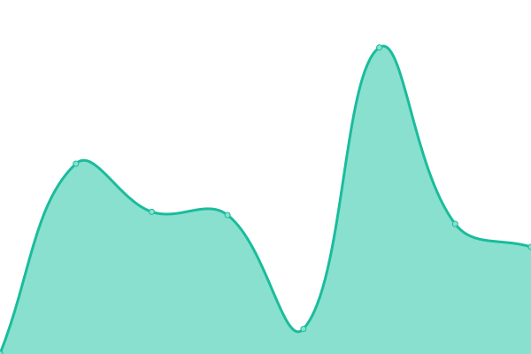

# [📈 Live Status](https://keywordnew.github.io/vancouver-watchtower): <!--live status--> **🟧 Partial outage**

This repository contains the open-source uptime monitor and status page for [Manil Chowdhury](https://manil.xyz), powered by [Upptime](https://github.com/upptime/upptime).

With [Upptime](https://upptime.js.org), you can get your own unlimited and free uptime monitor and status page, powered entirely by a GitHub repository. We use [Issues](https://github.com/keywordnew/vancouver-watchtower/issues) as incident reports, [Actions](https://github.com/keywordnew/vancouver-watchtower/actions) as uptime monitors, and [Pages](https://keywordnew.github.io/vancouver-watchtower) for the status page.

<!--start: status pages-->
<!-- This summary is generated by Upptime (https://github.com/upptime/upptime) -->
<!-- Do not edit this manually, your changes will be overwritten -->
<!-- prettier-ignore -->
| URL | Status | History | Response Time | Uptime |
| --- | ------ | ------- | ------------- | ------ |
|  [City of Vancouver](https://vancouver.ca/home-property-development/water-treatment.aspx) | 🟩 Up | [city-of-vancouver.yml](https://github.com/neighbourhood-cyber/vancouver-watchtower/commits/HEAD/history/city-of-vancouver.yml) | 

 395ms
     
 | 

<a href="https://keywordnew.github.io/vancouver-watchtower/history/city-of-vancouver">100.00%</a>
    

|  [British Columbia Hydro and Power Authority](https://www.bchydro.com/) | 🟥 Down | [british-columbia-hydro-and-power-authority.yml](https://github.com/neighbourhood-cyber/vancouver-watchtower/commits/HEAD/history/british-columbia-hydro-and-power-authority.yml) | 

 344ms
     
 | 

<a href="https://keywordnew.github.io/vancouver-watchtower/history/british-columbia-hydro-and-power-authority">98.56%</a>
    

|  [Telus Communications Inc](https://www.telus.com/en) | 🟩 Up | [telus-communications-inc.yml](https://github.com/neighbourhood-cyber/vancouver-watchtower/commits/HEAD/history/telus-communications-inc.yml) | 

 2575ms
     
 | 

<a href="https://keywordnew.github.io/vancouver-watchtower/history/telus-communications-inc">100.00%</a>
    

|  [Vancouver General Hospital](https://www.vch.ca/en/location/vancouver-general-hospital) | 🟥 Down | [vancouver-general-hospital.yml](https://github.com/neighbourhood-cyber/vancouver-watchtower/commits/HEAD/history/vancouver-general-hospital.yml) | 

 119ms
     
 | 

<a href="https://keywordnew.github.io/vancouver-watchtower/history/vancouver-general-hospital">0.00%</a>
    

|  [Vancouver Police Department](https://vpd.ca/report-a-crime/) | 🟩 Up | [vancouver-police-department.yml](https://github.com/neighbourhood-cyber/vancouver-watchtower/commits/HEAD/history/vancouver-police-department.yml) | 

 308ms
     
 | 

<a href="https://keywordnew.github.io/vancouver-watchtower/history/vancouver-police-department">100.00%</a>
    

|  [South Coast British Columbia Transportation Authority](https://www.translink.ca/) | 🟩 Up | [south-coast-british-columbia-transportation-authority.yml](https://github.com/neighbourhood-cyber/vancouver-watchtower/commits/HEAD/history/south-coast-british-columbia-transportation-authority.yml) | 

 664ms
     
 | 

<a href="https://keywordnew.github.io/vancouver-watchtower/history/south-coast-british-columbia-transportation-authority">100.00%</a>
    

|  [Vancouver City Savings Credit Union](https://www.vancity.com/) | 🟩 Up | [vancouver-city-savings-credit-union.yml](https://github.com/neighbourhood-cyber/vancouver-watchtower/commits/HEAD/history/vancouver-city-savings-credit-union.yml) | 

 446ms
     
 | 

<a href="https://keywordnew.github.io/vancouver-watchtower/history/vancouver-city-savings-credit-union">99.69%</a>
    

<!--end: status pages-->

[**Visit our status website →**](https://keywordnew.github.io/vancouver-watchtower)

## 📄 License

- Powered by: [Upptime](https://github.com/upptime/upptime)
- Code: [MIT](./LICENSE) © [Manil Chowdhury](https://manil.xyz)
- Data in the `./history` directory: [Open Database License](https://opendatacommons.org/licenses/odbl/1-0/)
